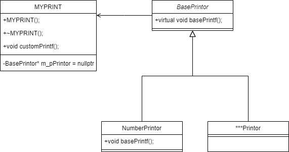

# 设计模式基础概念
大多数设计模式的概念和面向对象的概念是一致的，但有些有些许不同或增补：如下
1. 混入类(mixin Class):指一个可以继承了多个虚接口的虚类
2. 类继承和接口继承。如果按照我的个人理解，类继承会同时继承声明和实现，接口继承则是只需要继承声明即可。书上原话的描述非常精准-类继承根据一个对象的实现定义了另一个对象的实现。它是代码和表示的共享机制。接口继承描述了一个对象什么时候能被用来替代另一个对象。
3. 对接口编程而不是对实现编程：这个具体到操作规范，想一下前公司的代码,总会有一个基类负责实现，一个基类负责接口。负责实现的基类一般都是原本的控件，负责接口的则是另外的自定义纯虚类。这个设计非常符合CPP的原生设计，CPP原生设计中分开了声明和定义，但是类的继承其实并没有分开（声明的继承和实现的继承），面向接口编程本质上就是分开声明的继承和实现的继承。回想一下绝大多数的编程场景，我们并非真的希望从父类去继承一个实现，大多数时候只是约束所有的子类都应该有这个声明，因此这个时候其实另起一个纯虚类是更加合适的。
# 设计模式的分类
## 创建型设计模式

### 工厂模式(Factory Method) 

### 抽象工厂模式(Abstract Factory) 

### 建造者模式(builder pattern)

### 原型模式(Prototype)

### 单例模式(Singleton)

## 结构型设计模式
### 适配器模式(Adapter)
### 桥接模式(bridge)
### 组合模式(Composite)
### 装饰器模式(Decorator)
### 外观模式(Facade)
### 享元模式(Flyweight)
### 代理模式(Proxy)
## 行为型设计模式
### 解释器模式(interpreter)
### 模板模式(Template Method)
### 责任链模式(Chain of Responsibility)
### 命令模式(Command)
### 迭代器模式(Iterator)
### 中介者模式(Mediator)
### 备忘录模式(Memento)
### 观察者模式(Observer)
### 状态模式(State)
### 策略模式(Strategy)
策略模式的目的是，让一个行为可以方便地替换多种方案，比如函数A有可能使用多种计算方法（变化的），那么我们去额外写一个计算接口类，派生出实际的计算方法。在函数A中声明一个对象，然后在A的计算方法中调用对应的派生出的实际的计算方法。好处是之后需要添加或更改方法的时候只需要派生出新的子类，然后在A中修改调用即可。 
类图如下：

### 访问者模式(Vistor)

